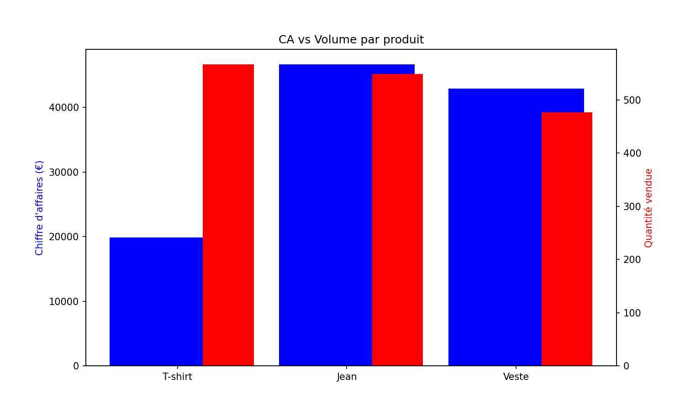
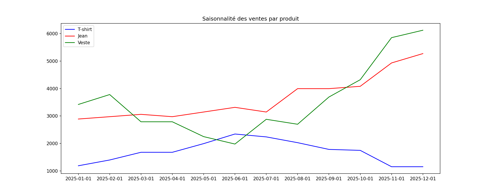
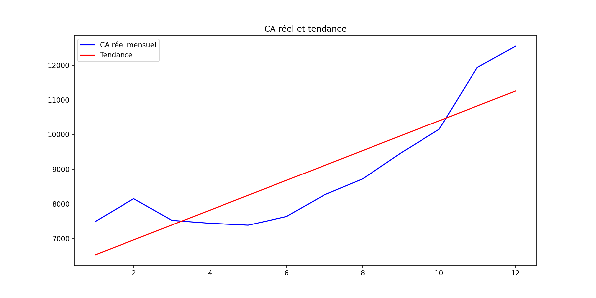
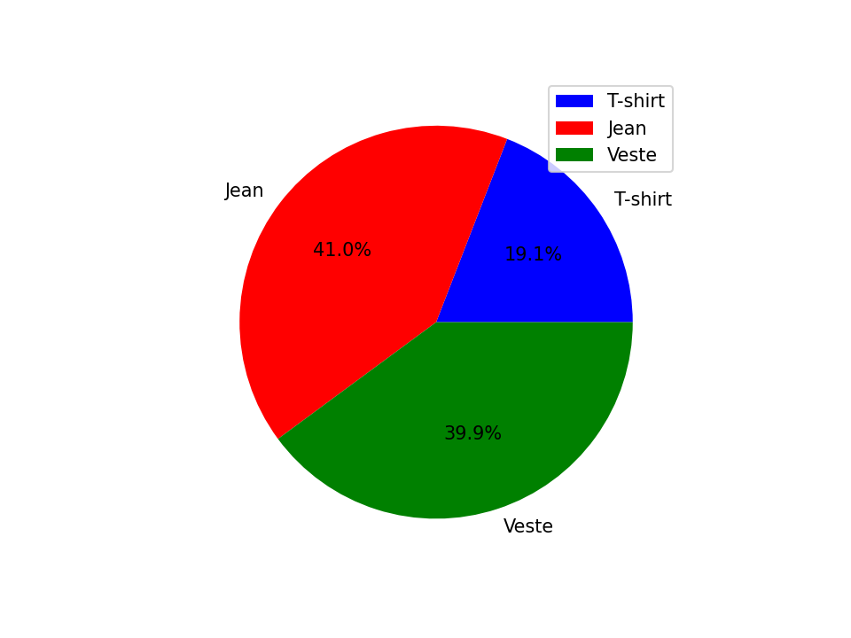
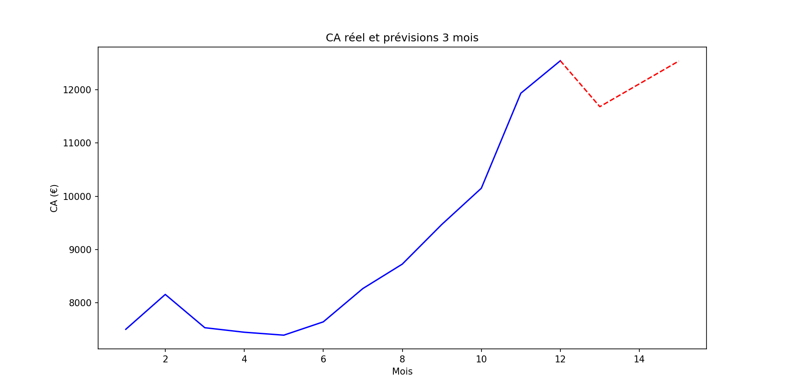

# Sales Intelligence Dashboard

A fictional sales analysis for a clothing brand — 12 months of data, business insights and 3-month forecast.

## Business Questions Answered
1. Which product generates the most revenue vs volume?
2. What is the best month for each product?
3. Are sales growing? At what rate?
4. What is each product's share of total revenue?
5. What revenue can we forecast for the next 3 months?

## Tech Stack
- Python · SQLite · Pandas · NumPy · Matplotlib

## Key Findings
- **Jean & Veste** generate ~80% of total revenue
- **+455€/month** average growth rate
- **Veste** peaks in winter (Dec), **T-shirt** peaks in summer
- Forecast: ~11 300€ → 12 100€ over the next 3 months

## Visualizations

